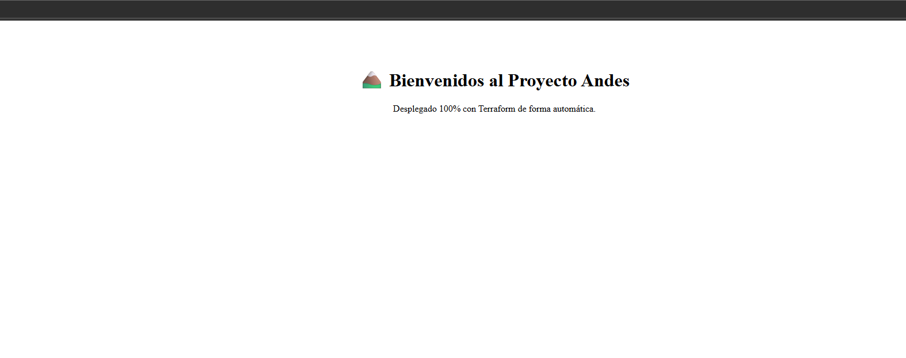

# Proyecto Andes: Automatización de Infraestructura en GCP

Este proyecto demuestra el despliegue profesional de una infraestructura dinámica usando **Terraform** en **Google Cloud Platform**. 

###  Resultado final:

Una vez que la pipeline de CI/CD termina con éxito, el servidor Nginx queda operativo y sirviendo la página de bienvenida:

